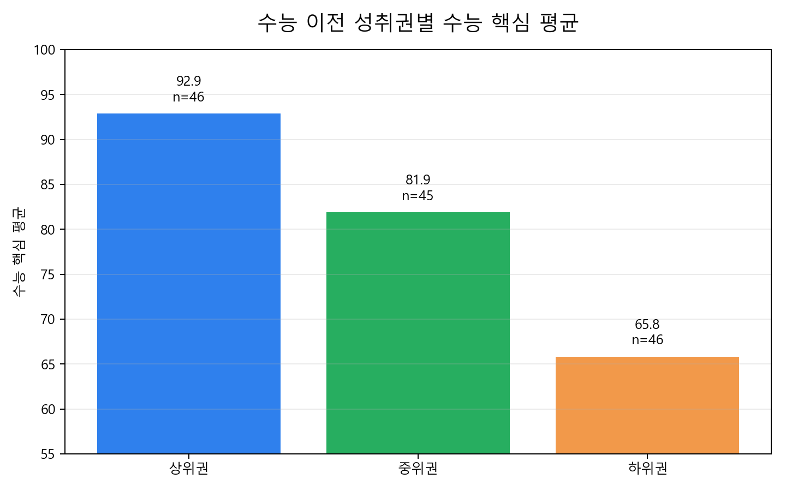
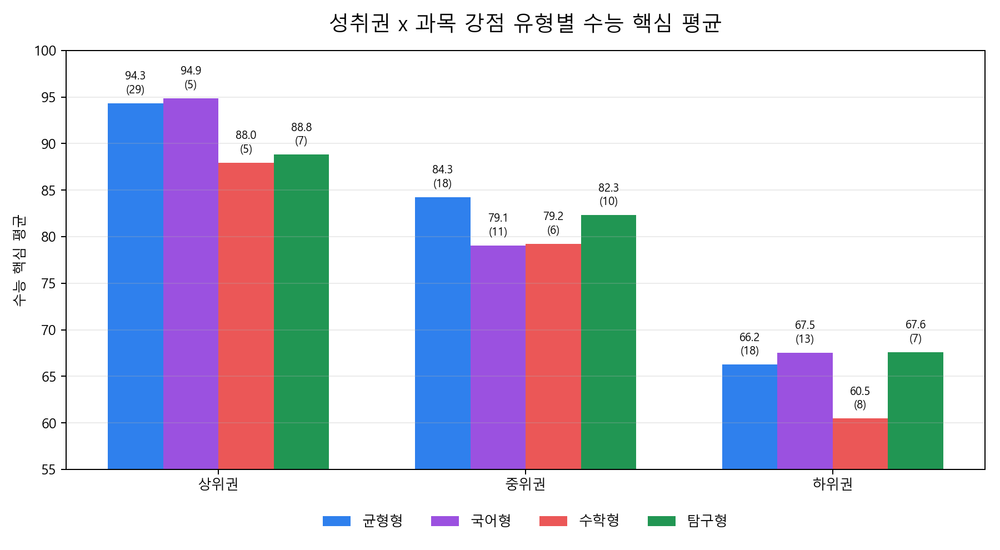
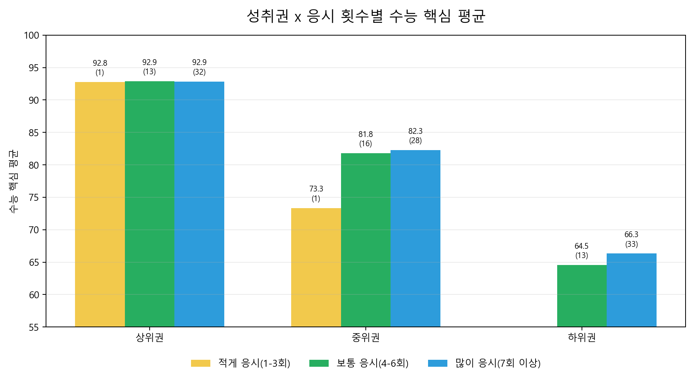
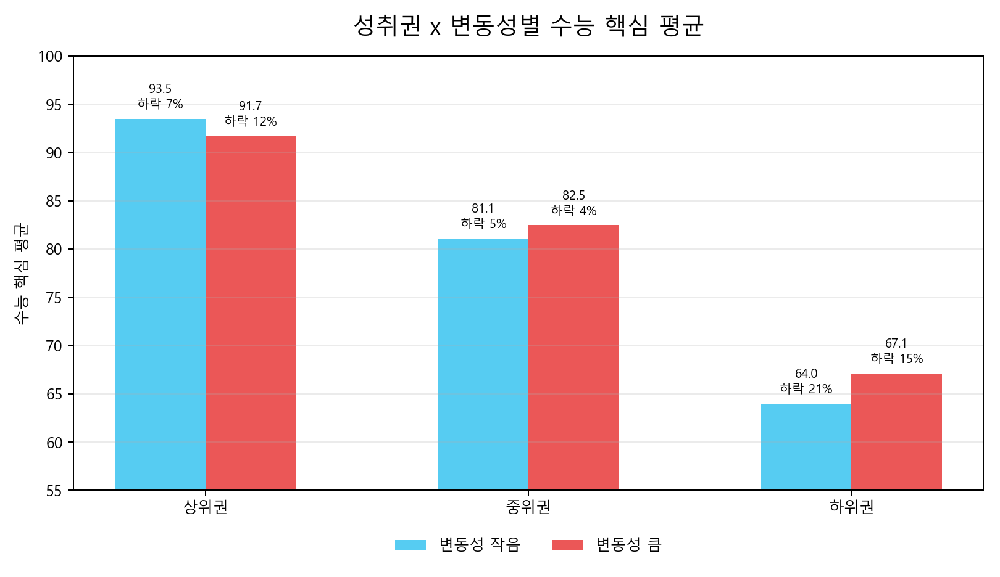
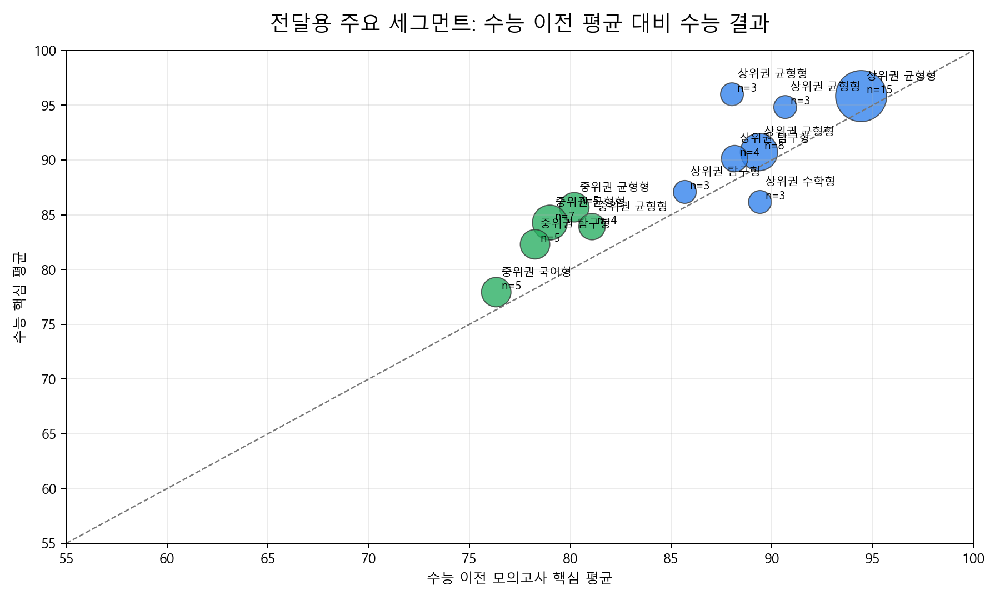
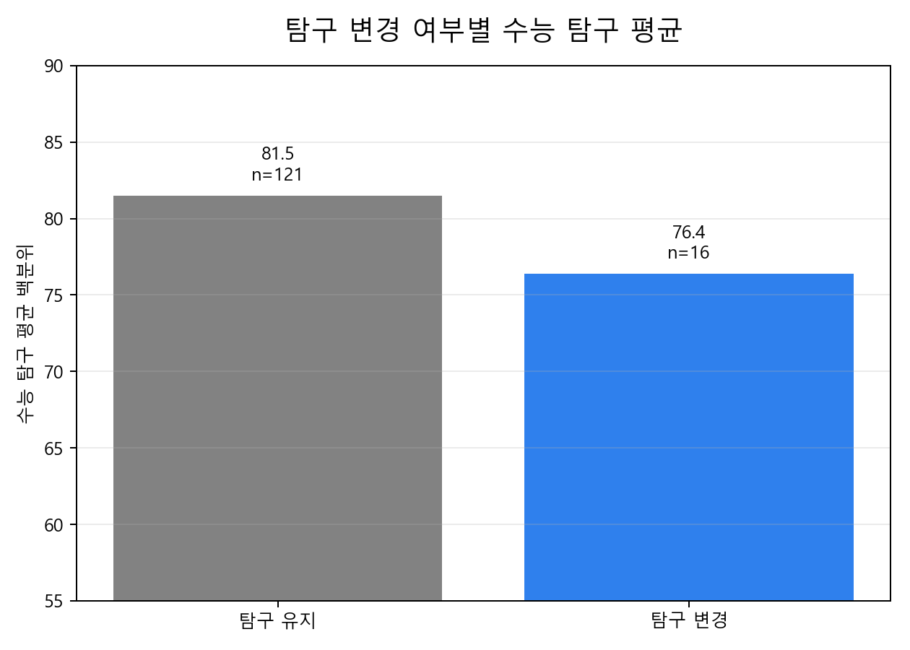
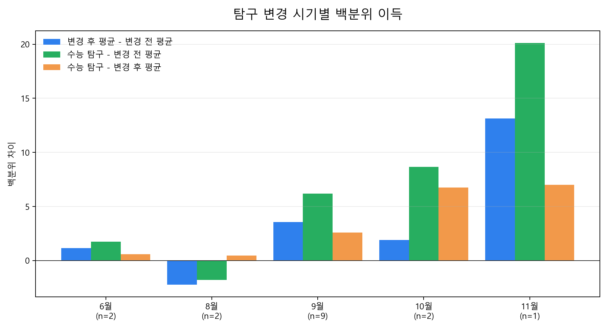
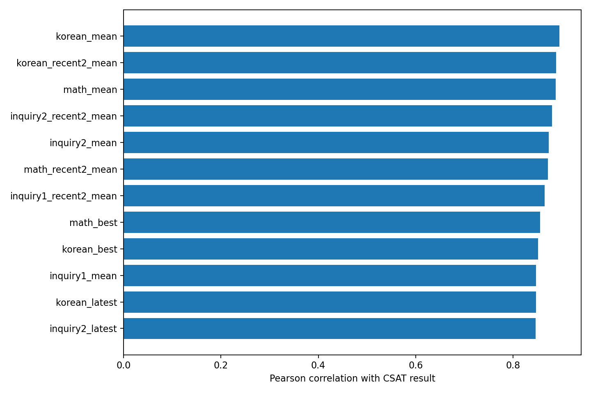
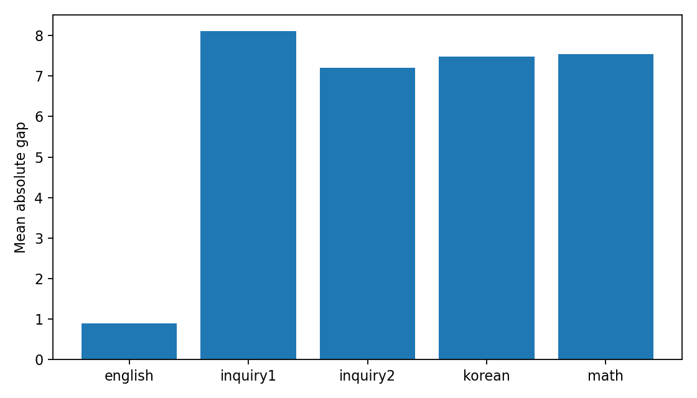
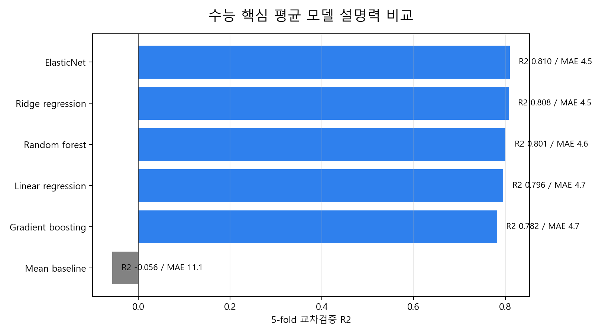

# 샘플 재원생 모의고사-수능 결과 인사이트 종합 리포트

> **데이터 출처:** 🟡 공개용 더미(데모) 데이터 · `source=sample` · 파일 `mock_exam_sample.xlsx`
> **표본:** 전체 180명 · 수능결과 137명 · 전체기록 1496건 · 수능이전기록 1031건
> **전처리 생성:** 2026-07-06T23:38:20

## 1. 분석 목적

본 리포트는 샘플 재원생의 누적 모의고사 기록과 수능 결과를 바탕으로, 학생들에게 전달할 수 있는 상담용 인사이트를 정리한 자료입니다. 개인별 수능 성적을 단정적으로 예측하기보다, 어떤 학습 패턴과 과목 조합이 최종 수능 결과와 연결되었는지를 확인하는 데 목적이 있습니다.

## 2. 데이터 기준

- 분석 대상: 수능 이전 모의고사 기록과 수능 결과가 모두 있는 137명
- 핵심 성과 지표: 국어, 수학, 탐구1, 탐구2 백분위 평균
- 영어는 등급 자료이므로 핵심 평균에는 포함하지 않고 보조 지표로 활용
- 점수 0은 미응시 또는 미기록 가능성이 높아 결측값으로 처리
- 상위권/중위권/하위권은 수능 이전 모의고사 핵심 평균의 3분위 기준

## 3. 월별 상/중/하위권 평균 백분위 흐름

리포트 초반에는 샘플 재원생들이 월별로 어떤 흐름을 보였는지 먼저 확인합니다. 아래 그래프는 수능 이전 모의고사 핵심 평균 기준으로 상/중/하위권을 나눈 뒤, 각 월의 국어/수학/탐구 평균 백분위를 비교한 것입니다.

| 월 | 상위권 평균 | 중위권 평균 | 하위권 평균 |
| --- | --- | --- | --- |
| 3월 | 89.0 | 76.5 | 62.3 |
| 4월 | 90.9 | 77.6 | 62.3 |
| 5월 | 89.6 | 77.7 | 61.4 |
| 6월 | 89.5 | 76.9 | 63.7 |
| 7월 | 90.2 | 79.2 | 62.7 |
| 8월 | 90.4 | 78.7 | 62.8 |
| 9월 | 92.4 | 79.5 | 63.6 |
| 10월 | 91.5 | 81.1 | 63.4 |
| 11월 | 91.9 | 81.0 | 63.5 |

월별 흐름은 학생들에게 가장 직관적으로 전달하기 좋은 자료입니다. 특히 상위권은 높은 평균을 비교적 유지하는지, 중위권과 하위권은 어느 시점에서 격차가 벌어지거나 좁혀지는지를 볼 수 있습니다.

## 4. 전체 요약

| 구분 | 학생 수 | 수능 이전 평균 | 수능 평균 | 수능 상위 25% 비율 | 수능 상승률 | 수능 하락률 |
| --- | --- | --- | --- | --- | --- | --- |
| 상위권 | 46 | 90.6 | 92.9 | 65.2% | 32.6% | 8.7% |
| 중위권 | 45 | 78.8 | 81.9 | 11.1% | 35.6% | 4.4% |
| 하위권 | 46 | 62.7 | 65.8 | 0.0% | 34.8% | 17.4% |

핵심적으로 상위권은 수능 결과도 높은 수준을 유지했고, 중위권과 하위권은 일부 상승 사례가 확인됩니다. 다만 하위권은 상승률이 존재하더라도 상위권 진입 비율은 낮아, 기본 성취 수준 자체를 끌어올리는 전략이 중요합니다.

## 5. 과목 강점 유형별 인사이트

이 데이터에서는 상위권에서 균형형 학생의 수능 결과가 가장 안정적으로 높았습니다. 중위권은 국어형, 수학형, 균형형의 차이가 크지 않아 약점 보완과 유지 전략을 함께 보는 것이 좋습니다. 하위권에서는 수학형 학생의 상승 가능성이 상대적으로 두드러졌습니다.

| 권역 | 강점 유형 | 학생 수 | 수능 평균 | 상승률 | 하락률 |
| --- | --- | --- | --- | --- | --- |
| 상위권 | 국어형 | 5 | 94.9 | 40.0% | 0.0% |
| 상위권 | 균형형 | 29 | 94.3 | 34.5% | 3.4% |
| 상위권 | 탐구형 | 7 | 88.8 | 14.3% | 14.3% |
| 상위권 | 수학형 | 5 | 88.0 | 40.0% | 40.0% |
| 중위권 | 균형형 | 18 | 84.3 | 44.4% | 5.6% |
| 중위권 | 탐구형 | 10 | 82.3 | 50.0% | 0.0% |
| 중위권 | 수학형 | 6 | 79.2 | 16.7% | 0.0% |
| 중위권 | 국어형 | 11 | 79.1 | 18.2% | 9.1% |
| 하위권 | 탐구형 | 7 | 67.6 | 28.6% | 28.6% |
| 하위권 | 국어형 | 13 | 67.5 | 46.2% | 23.1% |
| 하위권 | 균형형 | 18 | 66.2 | 44.4% | 11.1% |
| 하위권 | 수학형 | 8 | 60.5 | 0.0% | 12.5% |

## 6. 응시 횟수별 인사이트

응시 횟수는 인과로 해석하면 안 됩니다. 많이 응시했기 때문에 성적이 오른 것이 아니라, 재원 기간, 성실성, 기존 성취도, 시험 참여 성향이 함께 반영된 지표일 수 있습니다. 그럼에도 이 데이터에서는 4-6회 보통 응시 그룹이 전 권역에서 비교적 안정적인 결과를 보였습니다.

| 권역 | 응시 횟수 | 학생 수 | 수능 평균 | 상위 25% 비율 |
| --- | --- | --- | --- | --- |
| 상위권 | 보통 응시(4-6회) | 13 | 92.9 | 69.2% |
| 상위권 | 많이 응시(7회 이상) | 32 | 92.9 | 62.5% |
| 상위권 | 적게 응시(1-3회) | 1 | 92.8 | 100.0% |
| 중위권 | 많이 응시(7회 이상) | 28 | 82.3 | 7.1% |
| 중위권 | 보통 응시(4-6회) | 16 | 81.8 | 18.8% |
| 중위권 | 적게 응시(1-3회) | 1 | 73.3 | 0.0% |
| 하위권 | 많이 응시(7회 이상) | 33 | 66.3 | 0.0% |
| 하위권 | 보통 응시(4-6회) | 13 | 64.5 | 0.0% |

## 7. 변동성별 인사이트

상위권에서는 변동성이 작은 학생이 더 안정적으로 높은 수능 결과를 보였습니다. 변동성이 큰 상위권은 평균은 여전히 높지만 하락률이 커져, 월별 흔들림 관리가 중요한 신호로 보입니다.

| 권역 | 변동성 | 학생 수 | 수능 평균 | 수능-수능 이전 평균 | 하락률 |
| --- | --- | --- | --- | --- | --- |
| 상위권 | 변동성 작음 | 30 | 93.5 | 1.4 | 6.7% |
| 상위권 | 변동성 큼 | 16 | 91.7 | 3.8 | 12.5% |
| 중위권 | 변동성 작음 | 19 | 81.1 | 2.2 | 5.3% |
| 중위권 | 변동성 큼 | 26 | 82.5 | 3.8 | 3.8% |
| 하위권 | 변동성 작음 | 19 | 64.0 | 0.6 | 21.1% |
| 하위권 | 변동성 큼 | 27 | 67.1 | 5.0 | 14.8% |

## 8. 계층 이동 분석

계층 이동은 수능 이전 모의고사 기준 상/중/하위권과 수능 결과 기준 상/중/하위권을 비교해 계산했습니다. 상향 이동은 최종 수능 계층이 시작 계층보다 높아진 경우, 하향 이동은 낮아진 경우입니다.

- 상향 이동: 17명 (12.4%)
- 유지: 103명 (75.2%)
- 하향 이동: 17명 (12.4%)

강점 유형 기준으로는 탐구형과 수학형의 상향 이동 비율이 상대적으로 높게 나타났습니다. 다만 탐구형은 표본이 10명으로 작아, 안정적인 결론보다는 관찰 신호로 보는 것이 적절합니다.

| 강점 유형 | 학생 수 | 상향 이동률 | 하향 이동률 | 유지율 | 평균 이동 |
| --- | --- | --- | --- | --- | --- |
| 국어형 | 29 | 17.2% | 13.8% | 69.0% | 0.0 |
| 균형형 | 65 | 15.4% | 7.7% | 76.9% | 0.1 |
| 탐구형 | 24 | 8.3% | 16.7% | 75.0% | -0.1 |
| 수학형 | 19 | 0.0% | 21.1% | 78.9% | -0.2 |

응시 횟수 기준으로는 4-6회 보통 응시 그룹의 상향 이동률이 가장 높았습니다.

| 응시 횟수 | 학생 수 | 상향 이동률 | 하향 이동률 | 평균 이동 |
| --- | --- | --- | --- | --- |
| 많이 응시(7회 이상) | 93 | 12.9% | 10.8% | 0.0 |
| 보통 응시(4-6회) | 42 | 11.9% | 14.3% | -0.0 |
| 적게 응시(1-3회) | 2 | 0.0% | 50.0% | -0.5 |

변동성 기준으로는 상향 이동률 차이가 크지 않았습니다. 다만 변동성은 계층 이동보다 하락 위험이나 안정성 해석에 더 적합한 지표로 보입니다.

| 변동성 | 학생 수 | 상향 이동률 | 하향 이동률 | 평균 이동 |
| --- | --- | --- | --- | --- |
| 변동성 큼 | 69 | 17.4% | 11.6% | 0.1 |
| 변동성 작음 | 68 | 7.4% | 13.2% | -0.1 |

세부 유형 중 계층 이동이 활발했던 조합은 아래와 같습니다. 표본 수가 작으므로 학생 전달 시에는 '이 데이터에서 관찰된 사례'로 표현하는 것이 안전합니다.

| 시작 권역 | 강점 | 응시 | 변동성 | 학생 수 | 상향 이동률 | 하향 이동률 | 평균 이동 |
| --- | --- | --- | --- | --- | --- | --- | --- |
| 중위권 | 균형형 | 보통 응시(4-6회) | 변동성 큼 | 4 | 50.0% | 25.0% | 0.2 |
| 하위권 | 국어형 | 많이 응시(7회 이상) | 변동성 큼 | 7 | 42.9% | 0.0% | 0.4 |
| 중위권 | 균형형 | 많이 응시(7회 이상) | 변동성 큼 | 7 | 42.9% | 14.3% | 0.3 |
| 중위권 | 균형형 | 많이 응시(7회 이상) | 변동성 작음 | 5 | 40.0% | 0.0% | 0.4 |
| 하위권 | 균형형 | 많이 응시(7회 이상) | 변동성 큼 | 7 | 28.6% | 0.0% | 0.3 |
| 하위권 | 균형형 | 많이 응시(7회 이상) | 변동성 작음 | 6 | 16.7% | 0.0% | 0.2 |
| 하위권 | 균형형 | 보통 응시(4-6회) | 변동성 큼 | 4 | 0.0% | 0.0% | 0.0 |
| 하위권 | 탐구형 | 많이 응시(7회 이상) | 변동성 작음 | 4 | 0.0% | 0.0% | 0.0 |

## 9. 전달용 핵심 세그먼트

| 권역 | 강점 | 응시 | 변동성 | 학생 수 | 수능 평균 | 전달 메시지 |
| --- | --- | --- | --- | --- | --- | --- |
| 상위권 | 균형형 | 보통 응시(4-6회) | 변동성 큼 | 3 | 96.0 | 수능 결과가 강한 조합 / 수능 상승 사례 비율 높음 / 월별 흔들림 점검 필요 / 균형 유지 전략 유효 |
| 상위권 | 균형형 | 많이 응시(7회 이상) | 변동성 작음 | 15 | 95.8 | 수능 결과가 강한 조합 / 균형 유지 전략 유효 |
| 상위권 | 균형형 | 보통 응시(4-6회) | 변동성 작음 | 3 | 94.8 | 수능 결과가 강한 조합 / 균형 유지 전략 유효 |
| 상위권 | 균형형 | 많이 응시(7회 이상) | 변동성 큼 | 8 | 90.7 | 수능 결과가 강한 조합 / 수능 상승 사례 비율 높음 / 월별 흔들림 점검 필요 / 균형 유지 전략 유효 |
| 상위권 | 탐구형 | 많이 응시(7회 이상) | 변동성 작음 | 4 | 90.1 | 수능 결과가 강한 조합 / 약한 축 보완이 핵심 |
| 상위권 | 탐구형 | 많이 응시(7회 이상) | 변동성 큼 | 3 | 87.1 | 수능 결과가 강한 조합 / 수능 하락 위험 관찰 / 월별 흔들림 점검 필요 / 약한 축 보완이 핵심 |
| 상위권 | 수학형 | 보통 응시(4-6회) | 변동성 작음 | 3 | 86.2 | 수능 결과가 강한 조합 / 수능 하락 위험 관찰 / 약한 축 보완이 핵심 |
| 중위권 | 균형형 | 많이 응시(7회 이상) | 변동성 작음 | 5 | 85.7 | 수능 결과가 강한 조합 / 수능 상승 사례 비율 높음 / 균형 유지 전략 유효 |
| 중위권 | 균형형 | 많이 응시(7회 이상) | 변동성 큼 | 7 | 84.3 | 중간권 유지 조합 / 수능 상승 사례 비율 높음 / 월별 흔들림 점검 필요 / 균형 유지 전략 유효 |
| 중위권 | 균형형 | 보통 응시(4-6회) | 변동성 큼 | 4 | 83.9 | 중간권 유지 조합 / 수능 상승 사례 비율 높음 / 월별 흔들림 점검 필요 / 균형 유지 전략 유효 |
| 중위권 | 탐구형 | 많이 응시(7회 이상) | 변동성 큼 | 5 | 82.3 | 중간권 유지 조합 / 수능 상승 사례 비율 높음 / 월별 흔들림 점검 필요 / 약한 축 보완이 핵심 |
| 중위권 | 국어형 | 많이 응시(7회 이상) | 변동성 큼 | 5 | 77.9 | 중간권 유지 조합 / 월별 흔들림 점검 필요 / 약한 축 보완이 핵심 |

## 10. 탐구 과목 변경 인사이트

탐구 과목 변경은 학생과 학부모가 실제로 많이 궁금해하는 지점입니다. 여기서는 탐구1/탐구2 과목 조합이 바뀐 학생을 탐구 변경 학생으로 보고, 변경 전후 탐구 평균 백분위와 수능 탐구 평균을 비교했습니다.

| 구분 | 학생 수 | 수능 이전 탐구 평균 | 최신 수능 이전 탐구 | 수능 탐구 평균 | 수능-수능 이전 평균 |
| --- | --- | --- | --- | --- | --- |
| 탐구 유지 | 121 | 78.9 | 79.9 | 81.5 | 2.7 |
| 탐구 변경 | 16 | 71.6 | 73.0 | 76.4 | 4.8 |

탐구 변경 학생은 전체적으로 탐구 유지 학생보다 수능 이전 탐구 평균과 수능 탐구 평균이 낮았습니다. 따라서 단순히 '바꿔서 성적이 낮았다'고 해석하기보다, 애초에 탐구에서 어려움을 겪던 학생들이 변경을 선택했을 가능성을 함께 봐야 합니다.

| 변경 시기 | 학생 수 | 변경 후-전 | 수능-변경 전 | 수능-변경 후 | 변경 후 이득률 | 수능 이득률 | 변경 후 기록 수 |
| --- | --- | --- | --- | --- | --- | --- | --- |
| 6월 | 2 | 1.2 | 1.8 | 0.6 | 50.0% | 50.0% | 5.5 |
| 8월 | 2 | -2.2 | -1.8 | 0.5 | 50.0% | 50.0% | 4.5 |
| 9월 | 9 | 3.6 | 6.2 | 2.6 | 66.7% | 66.7% | 2.9 |
| 10월 | 2 | 1.9 | 8.7 | 6.8 | 100.0% | 100.0% | 1.5 |
| 11월 | 1 | 13.1 | 20.1 | 7.0 | 100.0% | 100.0% | 1.0 |

시기별로는 7월 변경 학생이 표본 6명으로 가장 많고, 변경 후 평균과 수능 탐구 모두 변경 전보다 높게 나타났습니다. 6월과 9월 변경은 이득 폭이 커 보이지만 표본이 각각 1명, 2명이라 참고 신호로만 봐야 합니다. 4-5월 변경 학생은 수능 탐구가 변경 전 평균보다 낮아, 변경 자체보다 탐구 선택의 어려움이 이미 컸던 집단일 가능성이 있습니다.

학생에게 전달할 때는 '언제 바꾸면 무조건 좋다'가 아니라, '늦은 변경은 적응 기록 수가 줄어들고, 변경 후에도 충분한 모의고사 검증이 필요하다'는 메시지가 안전합니다.

## 11. 모의고사 지표와 수능 결과의 관계

수능 결과와 가장 강하게 연결된 지표는 특정 시험 한 번의 결과보다, 수능 이전 모의고사 평균과 최근 평균이었습니다. 특히 수학과 국어 평균 지표가 강하게 나타났습니다.

| 과목 | 수능 이전 지표 | 표본 수 | 상관계수 |
| --- | --- | --- | --- |
| 국어 백분위 | korean_mean | 131 | 0.895 |
| 국어 백분위 | korean_recent2_mean | 131 | 0.888 |
| 수학 백분위 | math_mean | 134 | 0.888 |
| 탐구2 백분위 | inquiry2_recent2_mean | 133 | 0.880 |
| 탐구2 백분위 | inquiry2_mean | 133 | 0.873 |
| 수학 백분위 | math_recent2_mean | 134 | 0.872 |
| 탐구1 백분위 | inquiry1_recent2_mean | 132 | 0.865 |
| 수학 백분위 | math_best | 134 | 0.856 |

## 12. 시험별 수능과의 차이

| 과목 | 수능과 가장 가까운 시험 | 표본 수 | 평균 절대 차이 | 상관계수 |
| --- | --- | --- | --- | --- |
| 국어 백분위 | 11월 메가대성 더 프리미엄 모의고사 | 98 | 6.6 | 0.846 |
| 수학 백분위 | 10월 메가대성 더 프리미엄 모의고사 | 105 | 6.7 | 0.841 |
| 영어 등급 | 11월 메가대성 더 프리미엄 모의고사 | 105 | 0.8 | 0.637 |
| 탐구1 백분위 | 9월 평가원 모의고사 | 96 | 6.6 | 0.827 |
| 탐구2 백분위 | 10월 메가대성 더 프리미엄 모의고사 | 101 | 6.0 | 0.871 |

## 13. 모델 설명력 비교

모델 비교는 개인별 수능 결과를 예측하기 위한 목적이 아니라, 현재 데이터에서 어떤 형태의 설명 방식이 가장 타당한지 확인하기 위한 검증입니다. 복잡한 비선형 모델보다 선형 계열 모델이 충분히 높은 설명력을 보였기 때문에, 상담용 메시지에서는 단순하고 해석 가능한 지표를 우선하는 것이 적절합니다.

| 모델 | 표본 수 | 교차검증 R2 | MAE | RMSE |
| --- | --- | --- | --- | --- |
| ElasticNet | 137 | 0.810 | 4.5 | 5.6 |
| Ridge regression | 137 | 0.808 | 4.5 | 5.6 |
| Random forest | 137 | 0.801 | 4.6 | 5.8 |
| Linear regression | 137 | 0.796 | 4.7 | 5.8 |
| Gradient boosting | 137 | 0.782 | 4.7 | 6.0 |
| Mean baseline | 137 | -0.056 | 11.1 | 13.5 |

## 14. 학생에게 전달할 때의 표현 예시

- 샘플 데이터에서는 상위권 학생 중 국어, 수학, 탐구가 고르게 받쳐주는 균형형 학생의 수능 결과가 가장 안정적으로 높았습니다.
- 월별 평균 백분위 흐름을 보면 권역별 격차와 유지 양상이 드러나므로, 학생에게 현재 위치와 변화 방향을 설명하는 데 활용할 수 있습니다.
- 이 데이터에서는 전체의 75.2%가 같은 계층을 유지했고, 상향 이동은 12.4%, 하향 이동은 12.4%였습니다.
- 상위권이라도 월별 성적 변동이 큰 학생은 수능에서 하락한 사례가 더 많이 관찰되어, 흔들림 관리가 중요합니다.
- 중위권은 특정 한 과목 강점보다 약점 축을 줄이고 전체 평균을 끌어올리는 전략이 효과적으로 보입니다.
- 하위권에서는 상승 사례가 존재하지만, 상위권 진입보다는 기본 백분위 평균을 끌어올리는 누적 관리가 우선입니다.
- 응시 횟수는 결과의 원인으로 단정할 수 없지만, 일정 수준 이상 꾸준히 응시한 학생들이 더 안정적인 결과를 보였습니다.
- 탐구 과목 변경은 변경 자체의 효과보다 변경 전후에 충분한 검증 기록을 확보했는지가 더 중요해 보입니다.

## 15. 해석 주의

- 본 분석은 샘플 데이터의 패턴 요약이며 개인별 결과를 보장하지 않습니다.
- 표본 수가 작은 세그먼트는 방향성 참고용으로만 사용해야 합니다.
- 응시 횟수와 수능 결과의 관계는 인과가 아니라 상관 또는 집단 특성의 반영일 수 있습니다.
- 계층 이동은 3분위 기준의 상대적 이동이므로, 경계 부근 학생은 작은 점수 변화로도 이동할 수 있습니다.
- 탐구 변경 분석은 표본 수가 작아 시기별 결론을 강하게 일반화하면 안 됩니다.
- 수능 예측보다는 학습 상태 진단, 약점 보완, 변동성 관리, 상담 우선순위 설정에 활용하는 것이 적절합니다.
