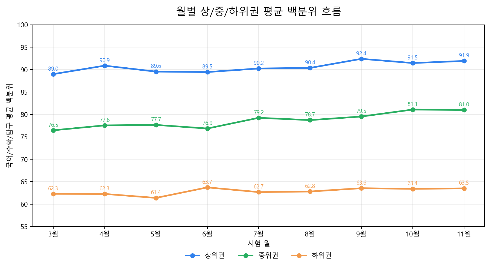
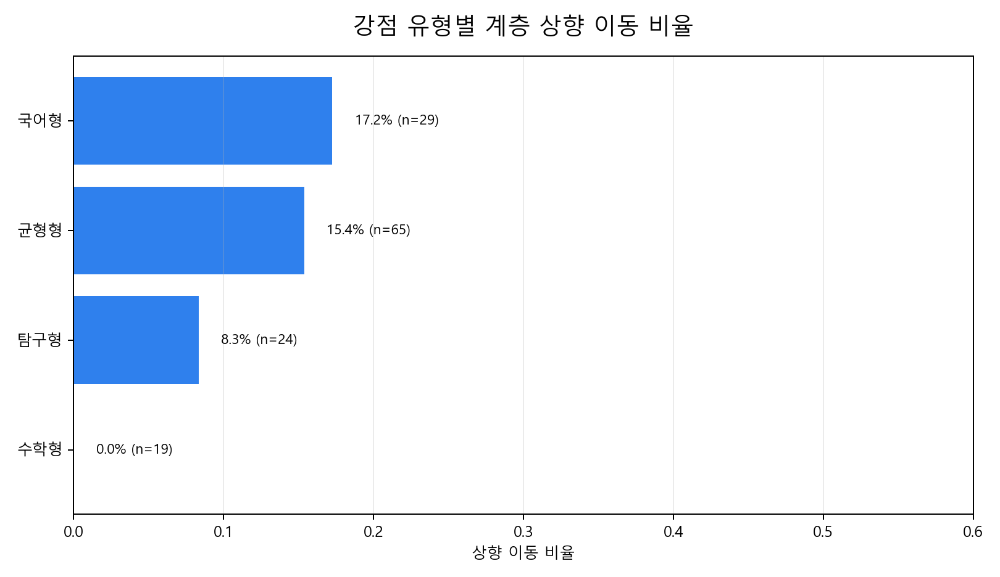

# 월별 흐름 및 계층 이동 분석

## 월별 상/중/하위권 평균 백분위

수능 이전 모의고사 핵심 평균을 기준으로 상/중/하위권을 나눈 뒤, 각 월의 평균 백분위를 비교했습니다.

## 계층 이동 기준

- 시작 계층: 수능 이전 모의고사 핵심 평균 기준 상/중/하위권
- 최종 계층: 수능 핵심 평균 기준 상/중/하위권
- 상향 이동: 최종 계층이 시작 계층보다 높아진 경우
- 하향 이동: 최종 계층이 시작 계층보다 낮아진 경우

## 전체 이동 결과

- 상향 이동: 17명 (12.4%)
- 유지: 103명 (75.2%)
- 하향 이동: 17명 (12.4%)

## 강점 유형별 상향 이동

- 국어형: n=29, 상향 17.2%, 하향 13.8%, 평균 이동 0.03
- 균형형: n=65, 상향 15.4%, 하향 7.7%, 평균 이동 0.08
- 탐구형: n=24, 상향 8.3%, 하향 16.7%, 평균 이동 -0.08
- 수학형: n=19, 상향 0.0%, 하향 21.1%, 평균 이동 -0.21

## 응시 횟수별 상향 이동

- 많이 응시(7회 이상): n=93, 상향 12.9%, 하향 10.8%, 평균 이동 0.02
- 보통 응시(4-6회): n=42, 상향 11.9%, 하향 14.3%, 평균 이동 -0.02
- 적게 응시(1-3회): n=2, 상향 0.0%, 하향 50.0%, 평균 이동 -0.50

## 변동성별 상향 이동

- 변동성 큼: n=69, 상향 17.4%, 하향 11.6%, 평균 이동 0.06
- 변동성 작음: n=68, 상향 7.4%, 하향 13.2%, 평균 이동 -0.06

## 계층 이동이 활발한 세부 유형

- 중위권 / 균형형 / 보통 응시(4-6회) / 변동성 큼: n=4, 상향 50.0%, 하향 25.0%, 평균 이동 0.25
- 하위권 / 국어형 / 많이 응시(7회 이상) / 변동성 큼: n=7, 상향 42.9%, 하향 0.0%, 평균 이동 0.43
- 중위권 / 균형형 / 많이 응시(7회 이상) / 변동성 큼: n=7, 상향 42.9%, 하향 14.3%, 평균 이동 0.29
- 중위권 / 균형형 / 많이 응시(7회 이상) / 변동성 작음: n=5, 상향 40.0%, 하향 0.0%, 평균 이동 0.40
- 하위권 / 균형형 / 많이 응시(7회 이상) / 변동성 큼: n=7, 상향 28.6%, 하향 0.0%, 평균 이동 0.29
- 하위권 / 균형형 / 많이 응시(7회 이상) / 변동성 작음: n=6, 상향 16.7%, 하향 0.0%, 평균 이동 0.17
- 하위권 / 균형형 / 보통 응시(4-6회) / 변동성 큼: n=4, 상향 0.0%, 하향 0.0%, 평균 이동 0.00
- 하위권 / 탐구형 / 많이 응시(7회 이상) / 변동성 작음: n=4, 상향 0.0%, 하향 0.0%, 평균 이동 0.00
- 상위권 / 균형형 / 보통 응시(4-6회) / 변동성 작음: n=3, 상향 0.0%, 하향 0.0%, 평균 이동 0.00
- 상위권 / 균형형 / 보통 응시(4-6회) / 변동성 큼: n=3, 상향 0.0%, 하향 0.0%, 평균 이동 0.00

## 해석 주의

- 계층 이동은 3분위 기준의 상대적 이동입니다. 절대 점수가 크게 변하지 않아도 경계 부근 학생은 이동할 수 있습니다.
- 표본 수가 작은 세부 유형은 방향성 참고용으로만 사용해야 합니다.
- 상향 이동이 많다는 것은 해당 유형의 모든 학생이 오른다는 뜻이 아니라, 작년 데이터에서 그런 사례 비율이 높았다는 의미입니다.